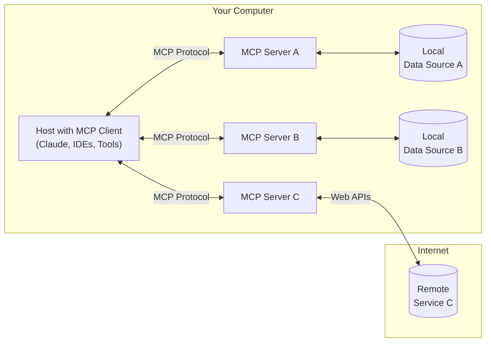

<Note>C# SDK 已发布！查看[最新更新内容](/development/updates)</Note>

MCP 是一个开放协议，用于标准化应用程序如何为 LLM 提供上下文。可以将 MCP 想象成 AI 应用程序的 USB-C 接口。就像 USB-C 为设备连接各种外设和配件提供标准化方式一样，MCP 为 AI 模型连接不同的数据源和工具提供了标准化方式。

## 为什么选择 MCP？

MCP 帮助你在 LLM 之上构建代理和复杂工作流。LLM 经常需要与数据和工具集成，而 MCP 提供：
- 预构建集成的不断增长列表，你的 LLM 可以直接插入使用
- 在不同 LLM 提供商和供应商之间切换的灵活性
- 在你的基础设施中保护数据的最佳实践

### 总体架构

从本质上讲，MCP 遵循客户端-服务器架构，其中主机应用程序可以连接到多个服务器：

- **MCP 主机**：想要通过 MCP 访问数据的程序，如 Claude Desktop、IDE 或 AI 工具
- **MCP 客户端**：与服务器保持 1:1 连接的协议客户端
- **MCP 服务器**：通过标准化的模型上下文协议暴露特定功能的轻量级程序
- **本地数据源**：MCP 服务器可以安全访问的计算机文件、数据库和服务
- **远程服务**：MCP 服务器可以连接的通过互联网（例如通过 API）提供的外部系统

## 开始使用

选择最适合你需求的路径：

#### 快速入门
<CardGroup cols={2}>
  <Card
    title="面向服务器开发者"
    icon="bolt"
    href="/quickstart/server"
  >
    开始构建你自己的服务器，以在 Claude Desktop 和其他客户端中使用
  </Card>
  <Card
    title="面向客户端开发者"
    icon="bolt"
    href="/quickstart/client"
  >
    开始构建可以与所有 MCP 服务器集成的客户端
  </Card>
  <Card
    title="面向 Claude Desktop 用户"
    icon="bolt"
    href="/quickstart/user"
  >
    开始在 Claude Desktop 中使用预构建的服务器
  </Card>
</CardGroup>

#### 示例
<CardGroup cols={2}>
  <Card
    title="服务器示例"
    icon="grid"
    href="/examples"
  >
    查看我们的官方 MCP 服务器和实现示例库
  </Card>
  <Card
    title="客户端示例"
    icon="cubes"
    href="/clients"
  >
    查看支持 MCP 集成的客户端列表
  </Card>
</CardGroup>

## 教程

<CardGroup cols={2}>
  <Card
    title="使用 LLM 构建 MCP"
    icon="comments"
    href="/tutorials/building-mcp-with-llms"
  >
    学习如何使用 Claude 等 LLM 加速你的 MCP 开发
  </Card>
  <Card
  title="调试指南"
  icon="bug"
  href="/docs/tools/debugging">
    学习如何有效调试 MCP 服务器和集成
  </Card>
  <Card
    title="MCP 检查器"
    icon="magnifying-glass"
    href="/docs/tools/inspector"
  >
    使用我们的交互式调试工具测试和检查你的 MCP 服务器
  </Card>
  <Card
    title="MCP 工作坊（视频，2小时）"
    icon="person-chalkboard"
    href="https://www.youtube.com/watch?v=kQmXtrmQ5Zg"
  >
    <iframe src="https://www.youtube.com/embed/kQmXtrmQ5Zg"> </iframe>
  </Card>
</CardGroup>

## 探索 MCP

深入了解 MCP 的核心概念和功能：

<CardGroup cols={2}>
  <Card
    title="核心架构"
    icon="sitemap"
    href="/docs/concepts/architecture"
  >
    了解 MCP 如何连接客户端、服务器和 LLM
  </Card>
  <Card
    title="资源"
    icon="database"
    href="/docs/concepts/resources"
  >
    从你的服务器向 LLM 暴露数据和内容
  </Card>
  <Card
    title="提示词"
    icon="message"
    href="/docs/concepts/prompts"
  >
    创建可重用的提示词模板和工作流
  </Card>
  <Card
    title="工具"
    icon="wrench"
    href="/docs/concepts/tools"
  >
    使 LLM 能够通过你的服务器执行操作
  </Card>
  <Card
    title="采样"
    icon="robot"
    href="/docs/concepts/sampling"
  >
    让你的服务器从 LLM 请求补全
  </Card>
  <Card
    title="传输"
    icon="network-wired"
    href="/docs/concepts/transports"
  >
    了解 MCP 的通信机制
  </Card>
</CardGroup>

## 贡献

想要贡献？查看我们的[贡献指南](/development/contributing)，了解如何帮助改进 MCP。

## 支持和反馈

以下是获取帮助或提供反馈的方式：

- 对于与 MCP 规范、SDK 或文档（开源）相关的错误报告和功能请求，请[创建 GitHub issue](https://github.com/modelcontextprotocol)
- 对于有关 MCP 规范的讨论或问答，请使用[规范讨论](https://github.com/modelcontextprotocol/specification/discussions)
- 对于有关其他 MCP 开源组件的讨论或问答，请使用[组织讨论](https://github.com/orgs/modelcontextprotocol/discussions)
- 对于与 Claude.app 和 claude.ai 的 MCP 集成相关的错误报告、功能请求和问题，请发送电子邮件至 mcp-support@anthropic.com
